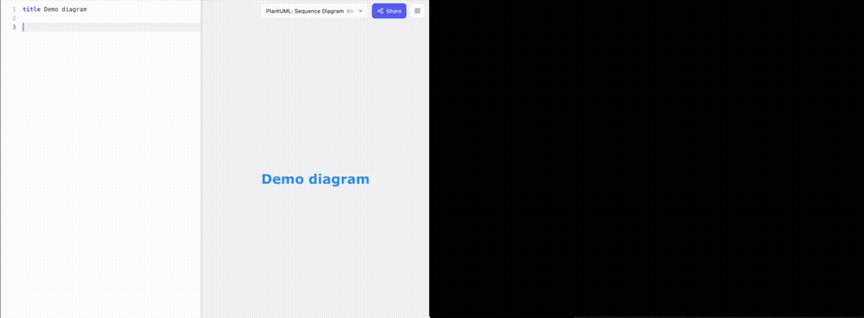

# Pumler

**Real-time collaborative text-to-diagram editor for PlantUML and Structurizr.**

[Try now](https://pumler.com) · [Public issues](https://github.com/pumler/pumler/issues) · [Contact](mailto:info@pumler.com)

## Why Pumler

Pumler is built for architects and tech leads who need fast, reliable diagramming workflows in real teams.

- Real-time collaboration for text-based diagrams
- Live preview while you edit
- Multiple syntaxes in one editor (PlantUML and Structurizr today)
- Free core experience for everyday diagram editing

## Why Another Diagram Editor?

Text-to-diagram workflows are one of the fastest ways to create and maintain technical diagrams. They are easier to version, review, and update than drag-and-drop canvases.

But modern teams still need collaboration, permanent links, and better lifecycle support around those diagrams. Pumler focuses on closing that gap.

## Theme Preview

Dark theme:

Light theme:

## Live Collaboration Demo

Short clip showing two browser windows editing one shared diagram in real time.

Landing clip: `docs/assets/media/live-collaboration.webm`

## What You Can Do Today

- Create and edit diagrams online with instant rendering
- Work in PlantUML and Structurizr syntax
- Collaborate in real time
- Share diagrams quickly with your team

## Supported Diagram Syntaxes

- PlantUML
- Structurizr (C4)

More syntaxes are planned.

## Roadmap

### Coming Soon

- Mermaid support
- User account workspace
- Diagram version history
- Permanent links

### Enterprise Direction

- SSO/SAML
- RBAC (roles and permissions)
- Audit logs
- Private team workspaces
- API and webhooks
- Self-hosted / on-prem option

## Current Security Posture

- HTTPS for web traffic
- WSS and WebRTC-based peer-to-peer for collaboration transport
- Diagrams are currently **not stored on the server**

## FAQ

### Is Pumler free?

Core editing and collaboration stays free. Some advanced capabilities may move to paid plans over time.

### Is Pumler open source?

Not yet. Pumler is actively developed, with public issue tracking and feedback on GitHub.

### Who is Pumler for?

Architects, tech leads, and teams using text-based diagrams in documentation and architecture workflows.

### Does Pumler support C4 diagrams?

Yes. Pumler supports Structurizr syntax, including C4-style workflows.

### Does Pumler support sequence diagrams online?

Yes. Pumler supports PlantUML sequence diagrams with live preview.

### Will you add Mermaid?

Yes, Mermaid support is on the roadmap.

### Do I need to install anything?

No. Pumler runs in the browser.

### Where do I report bugs or request features?

Use [GitHub Issues](https://github.com/pumler/pumler/issues).

## Feedback And Contribution

We welcome product feedback, feature ideas, and bug reports via [GitHub Issues](https://github.com/pumler/pumler/issues).

## Contact

- Email: [info@pumler.com](mailto:info@pumler.com)
- GitHub: [github.com/pumler/pumler](https://github.com/pumler/pumler)
