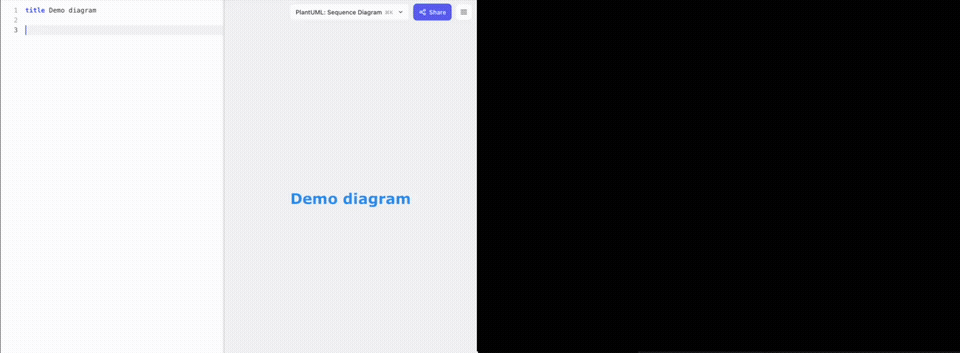
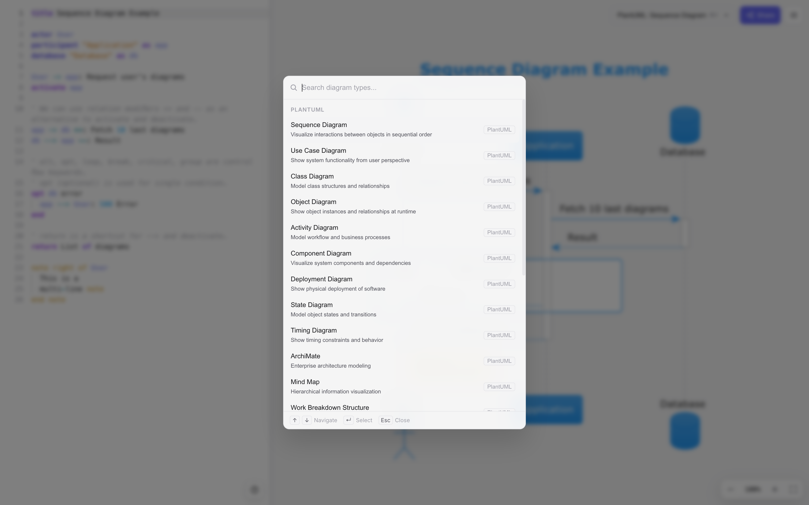
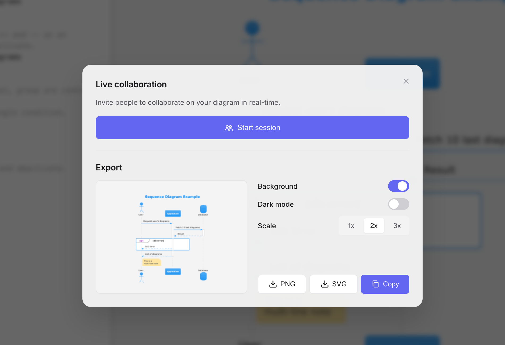
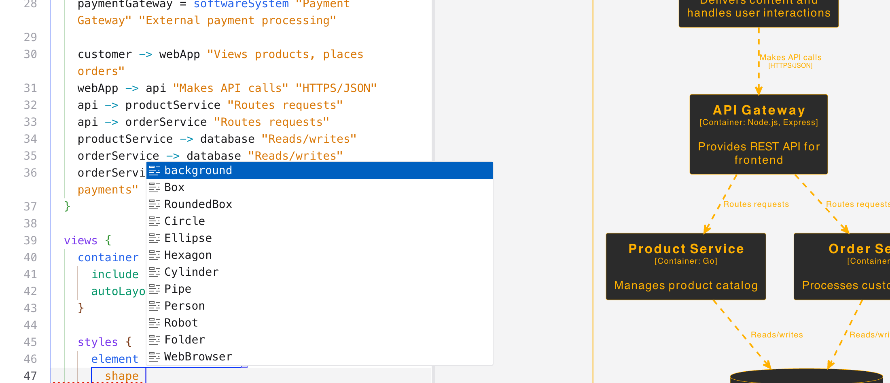

# Pumler

**Real-time collaborative text-to-diagram editor for PlantUML, Mermaid, and Structurizr.**

[Try now](https://pumler.com) · [Public issues](https://github.com/pumler/pumler/issues) · [Contact](mailto:info@pumler.com)

## What Pumler Solves

Pumler is built for architects and tech leads who prefer text-to-diagram workflows, but need modern collaboration and sharing capabilities in the same place.

## Core Capabilities

### Live collaboration

Edit one diagram together in real time.

### Multiple syntaxes

Use PlantUML, Mermaid, and Structurizr in one editor.

## Supported Diagram Types

### PlantUML

`sequence`, `usecase`, `class`, `object`, `activity`, `component`, `deployment`, `state`, `timing`, `archimate`, `mindmap`, `wbs`, `json`, `yaml`, `er`, `nwdiag`

### Structurizr

`systemContext`, `container`, `component`, `deployment`

### Mermaid

`flowchart`, `sequence`, `class`, `er`, `journey`, `gantt`, `pie`, `quadrant`, `requirement`, `gitgraph`, `c4`, `mindmap`, `timeline`, `sankey`, `xychart`, `block`, `packet`, `kanban`, `architecture`, `radar`, `treemap`

### Rich export controls

Export as SVG or PNG, copy image to clipboard, select theme, toggle background, and use upscale presets (including x2 and x4).

### Syntax highlight and code completion

Readable syntax colors and inline completion help reduce small DSL mistakes while editing.

## Security Snapshot

- HTTPS for web traffic
- WSS and WebRTC transport for collaboration
- Diagrams are currently **not stored on the server**

## Roadmap

### Coming soon

- User accounts
- Diagram version history
- Permanent links

### Enterprise direction

- SSO/SAML
- RBAC and permissions
- Audit logs
- Private workspaces
- API and webhooks
- Self-hosted option

## FAQ

### Is Pumler free?

Core editing is free forever. Some advanced capabilities may move to paid plans over time.

### Is Pumler open source?

Not yet. Product feedback and feature requests are public via GitHub issues.

### Does Pumler support C4 diagrams?

Yes. Structurizr is supported today, and Mermaid `c4` is supported as well.

### Does Pumler support sequence diagrams online?

Yes. Sequence diagrams are supported in both PlantUML and Mermaid with live preview.

### Does Pumler support Mermaid?

Yes. Mermaid support is available today, including flowcharts, sequence diagrams, ER diagrams, Gantt charts, C4, Kanban, timelines, Sankey, treemaps, and more.

### Do I need to install anything?

No. Pumler runs in the browser.

## Feedback

We welcome feature ideas and bug reports via [GitHub Issues](https://github.com/pumler/pumler/issues).

## Contact

- Email: [info@pumler.com](mailto:info@pumler.com)
- GitHub: [github.com/pumler/pumler](https://github.com/pumler/pumler)
